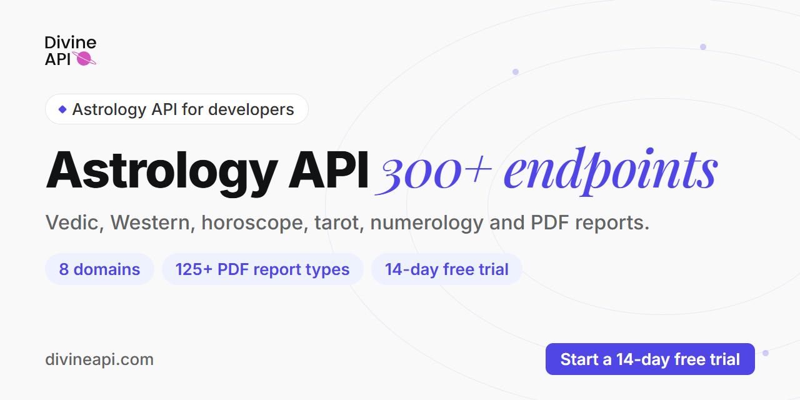

# DivineAPI



**Astrology API for developers: Vedic (kundli, panchang), Western (natal charts), horoscopes, tarot, numerology and white-label PDF reports as JSON over REST. Hosted MCP servers bring the same data to AI assistants.**

[](https://developers.divineapi.com)
[](https://divineapi.com/start-trial)
[](https://documenter.getpostman.com/view/26759678/2sBYAysU8Y)
[](https://status.divineapi.com)
[](https://divineapi.com/mcp)

## At a glance

| | |
|---|---|
| Endpoints | 300+ across 8 domains |
| Vedic (Indian) astrology | 140+ endpoints, 8 Indian languages |
| Western astrology | 60+ endpoints, 12 languages on text reports |
| Horoscope and tarot | 40+ endpoints, 25 languages |
| Numerology | 15+ endpoints, English |
| White-label PDF reports | 125+ report types |
| Response times | from 72ms |
| SDKs | Python, Node.js / TypeScript, PHP |
| Hosted MCP servers | 3 (Vedic, Western, horoscope / tarot / numerology) |
| WordPress plugin | 9,000+ downloads |
| Used by | 600+ businesses |
| Founded | 2021 in New Delhi, India |

## Get started

1. **Start the trial.** [Start a 14-day free trial](https://divineapi.com/start-trial) (credit card required to activate the trial).
2. **Copy your keys.** Take the **API key** and **auth token** from the dashboard.
3. **Make your first call.** Every endpoint is a `POST` with a multipart form: the auth token goes in the `Authorization: Bearer` header and the API key in the `api_key` field. This one compares two zodiac signs:

```bash
curl -s -X POST https://astroapi-5.divineapi.com/api/v2/love-compatibility \
  -H "Authorization: Bearer YOUR_AUTH_TOKEN" \
  -F api_key=YOUR_API_KEY \
  -F sign_1=aries -F sign_2=leo
```

Real response (2 Oct 2026, trimmed with `...`):

```json
{
  "success": 1,
  "data": {
    "prediction": {
      "sign_1": "Aries",
      "sign_2": "Leo",
      "overall_compatibility": "In love, two fire signals can't be stopped. When Aries and Leo meet for the first time, ...",
      "positive_aspects": "Leos and Aries are natural-born flirts who bond immediately and fall in love rapidly. ...",
      "negative_aspects": "Leo-Aries is a good combination, but it doesn't come without flaws. ...",
      "ideal_date": "An ideal date would be camping in the woods, where the two can spend a lot of time together.",
      "score": { "general": "8.5", "communication": "9", "...": "..." }
    }
  }
}
```

The developer hub with quickstarts in curl, Python, Node.js and PHP is **[astrology-api](https://github.com/DivineAPI/astrology-api)**.

## Repositories

- **REST API quickstarts:** [kundli-api](https://github.com/DivineAPI/kundli-api) · [kundli-matching-api](https://github.com/DivineAPI/kundli-matching-api) · [lal-kitab-api](https://github.com/DivineAPI/lal-kitab-api) · [panchang-api](https://github.com/DivineAPI/panchang-api) · [hindu-festival-api](https://github.com/DivineAPI/hindu-festival-api) · [birth-chart-api](https://github.com/DivineAPI/birth-chart-api) · [horoscope-api](https://github.com/DivineAPI/horoscope-api) · [tarot-api](https://github.com/DivineAPI/tarot-api) · [numerology-api](https://github.com/DivineAPI/numerology-api)
- **SDKs:** [divineapi-python](https://github.com/DivineAPI/divineapi-python) (`pip install divineapi`) · [divineapi-node](https://github.com/DivineAPI/divineapi-node) (`npm install divineapi`) · [divineapi-php](https://github.com/DivineAPI/divineapi-php) (`composer require divineapi/divineapi`)
- **MCP servers for Claude, Cursor and VS Code:** [mcp-indian-astrology](https://github.com/DivineAPI/mcp-indian-astrology) · [mcp-western-astrology](https://github.com/DivineAPI/mcp-western-astrology) · [mcp-horoscope-numerology](https://github.com/DivineAPI/mcp-horoscope-numerology)

## Questions developers ask

**Are the Vedic and Western endpoints calculated the same way?**
No. Vedic endpoints use the sidereal zodiac with the Lahiri ayanamsa (fixed); Western endpoints use the tropical zodiac. Both take their astronomical positions from Swiss Ephemeris, used under a commercial licence.

**Can responses come back in Hindi or other languages?**
Yes, with the `lan` field. Vedic endpoints answer in 8 Indian languages, Western text reports in 12 languages, and horoscopes and tarot in 25 languages through the translator host. Numerology is English only. DivineAPI uses its own codes, for example `ma` for Marathi and `tm` for Tamil.

**How does authentication work?**
Every REST call sends both: the auth token in the `Authorization: Bearer` header and the API key in the `api_key` form field. The hosted MCP servers take the same pair as the `X-Divine-Api-Key` and `X-Divine-Auth-Token` headers.

**How do I get access?**
Start the [14-day free trial](https://divineapi.com/start-trial) (credit card required to activate the trial) and copy both values from the dashboard. Plans are sold per product; compare them at [divineapi.com/pricing](https://divineapi.com/pricing).

**Where is the full API reference?**
At [developers.divineapi.com](https://developers.divineapi.com), with the OpenAPI file at [developers.divineapi.com/openapi.yaml](https://developers.divineapi.com/openapi.yaml) and a [Postman collection](https://documenter.getpostman.com/view/26759678/2sBYAysU8Y).

## Links

| | |
|---|---|
| Website | [divineapi.com](https://divineapi.com) |
| Docs | [developers.divineapi.com](https://developers.divineapi.com) |
| Pricing | [divineapi.com/pricing](https://divineapi.com/pricing) |
| Report samples | [reports.divineapi.com/reports](https://reports.divineapi.com/reports) |
| Status | [status.divineapi.com](https://status.divineapi.com) |
| Support | [support.divineapi.com](https://support.divineapi.com) |
| LinkedIn | [linkedin.com/company/divineapi](https://www.linkedin.com/company/divineapi) |
| X | [x.com/divineapi](https://x.com/divineapi) |
| YouTube | [youtube.com/@divineapi](https://www.youtube.com/@divineapi) |
